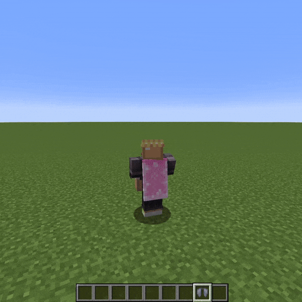

# Elytra Only Cape Option Mod
Fabric 1.21
***
Elytra Only Cape Option is a client-side mod that adds the option to
display the cape only when Elytra is equipped.

This mod is useful for players who want to have a custom skin for the Elytra,
but do not want the cape to be displayed without it.

This option is enabled in the skin customization menu.

***
## Instalation

Download the **elytra-only-cape-option.jar** file from this repository.

Download [Fabric API](https://modrinth.com/mod/fabric-api).

